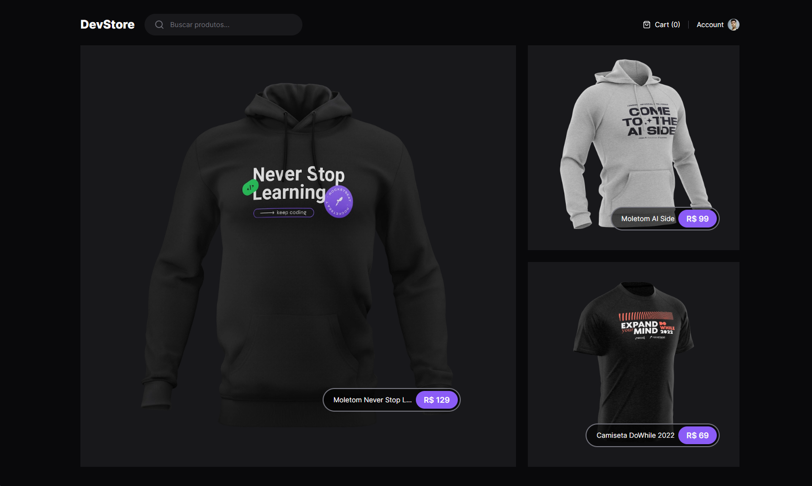
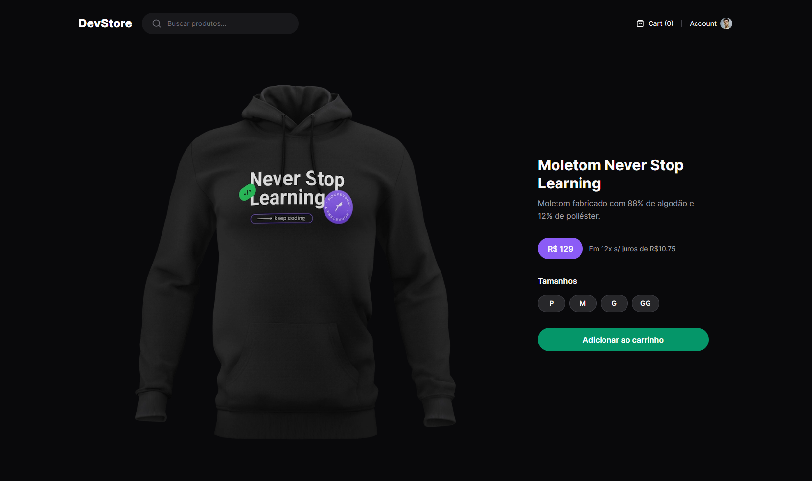

[TYPESCRIPT__BADGE]: https://img.shields.io/badge/TypeScript-007ACC?style=for-the-badge&logo=typescript&logoColor=white
[TAILWIND__BADGE]: https://img.shields.io/badge/Tailwind_CSS-38B2AC?style=for-the-badge&logo=tailwind-css&logoColor=white
[NEXTJS__BADGE]: https://img.shields.io/badge/next.js-000000?style=for-the-badge&logo=nextdotjs&logoColor=white\
[CYPRESS__BADGE]: https://img.shields.io/badge/Cypress-17202C?style=for-the-badge&logo=cypress&logoColor=whit
<h1 align="center" style="font-weight: bold;">DevStore</h1>

<div align="center">
  
  ![TypeScript][TYPESCRIPT__BADGE]
  ![NextJs][NEXTJS__BADGE]
  ![Tailwind][TAILWIND__BADGE]
  ![Cypress][CYPRESS__BADGE]
  
</div>

<p align="center">
  
  
</p>

<h2 id="started">🚀 Getting started</h2>
Antes de começar, você vai precisar ter instalado em sua máquina as seguintes ferramentas: Git, Node.js.

<h3>Cloning</h3>

```bash
git clone https://github.com/frittzdev/next-DevStore.git
```

<h3>Starting</h3>

```bash
cd next-DevStore
npm run start
```

